## Sail_vina_2.0
Autodock Vina对接GUI界面

开发中……，已经完成：  
1. 准备受体
1. 准备配置文件
2. 准备配体
3. 批量对接
4. 生成配体-蛋白复合物  

下一步计划：  
2. 分析作用力
3. 提取分数，计算RMSD

---
### 软件的安装：  
方法一：下载[main.zip](https://stmailhbtcmeducn-my.sharepoint.com/:u:/g/personal/1731701280_stmail_hbtcm_edu_cn/EZz41yb7CmxNvV9nDrWdVd4BbnDhGj5Dq9NwX1LYgkwZLg?e=dE3jFn)到需要安装的目录，解压，直接运行内部的main.exe文件即可。  
软件界面：  
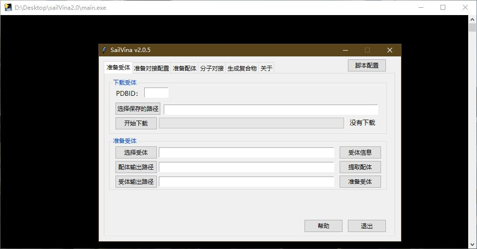
**注意：本软件的解压路径不要包含空格和中文！**  
方法二：克隆本项目到本地，在SailVina中用python运行main.py
- 需要requests（下载pdb）、biopython（准备受体）模块，使用pip安装即可。
  
系统需求：  
- 安装obabel   
    [64位下载](https://sourceforge.net/projects/openbabel/files/openbabel/2.4.1/OpenBabel-2.4.1.exe/download)
    [32位下载](https://sourceforge.net/projects/openbabel/files/openbabel/2.4.1/OpenBabel-2.4.1-x86.exe/download)
- 安装ADT  
[ADT下载](http://mgltools.scripps.edu/downloads/downloads/tars/releases/REL1.5.6/mgltools_win32_1.5.6_Setup.exe)

---

### 教程：伊马替尼以及自定义配体和络氨酸激酶对接
可以通过本教程测试软件是否配置正确，建议使用同样的文件夹。  

新建本教程文件夹：  
D:/test_sailvina/Ligands/mol  
D:/test_sailvina/Ligands/pdbqt  
D:/test_sailvina/Proteins/1IEP_imatinib  
D:/test_sailvina/Docking_output  

0. 配置脚本
    - 点击脚本配置，点击"选择adt的python路径"，选择ADT中的python.exe。比如C:/DrugDesign/mgltools/python.exe。
    - 点击"选择obabel.exe的路径"，选择安装的obabel的obabel.exe。比如C:/OpenBabel-2.4.1/obabel.exe。点击确定。
    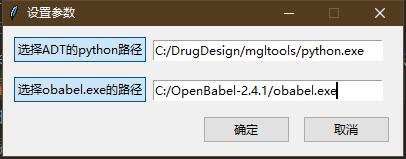
    出现路径配置成功表示配置完成。
1. 下载pdb  
准备受体界面，下载受体。  
    - PDBID输入1iep，点击"选择保存的路径"选择D:/test_sailvina/Proteins/1IEP_imatinib，点击开始下载。  
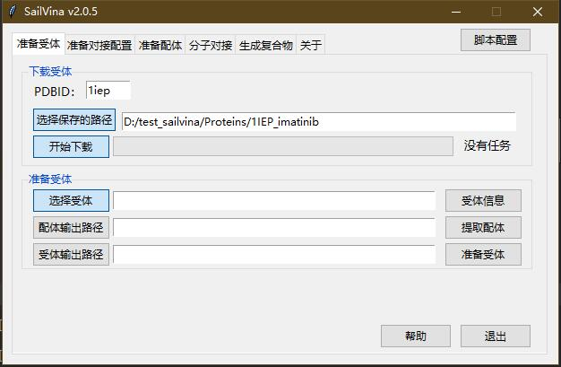
2. 准备受体  
准备受体界面，准备受体。  
    - 点击"选择受体"，选择D:/test_sailvina/Proteins/1IEP_imatinib/1iep.pdb
        - 点击"受体信息"可以看到选择受体的基本信息，比如名称，结晶方法，打开文献的网页等  
  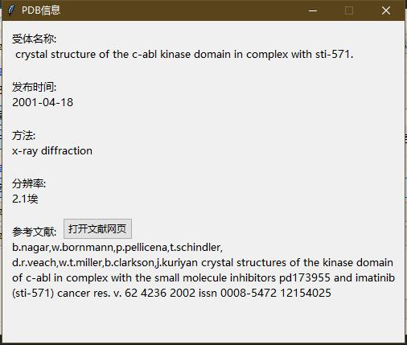  
    - 点击"配体输出路径"，选择D:/test_sailvina/Ligands/pdbqt
    - 点击"提取配体"。model选择0，下一步，chain选择A，下一步，选择STI点击提取配体。
    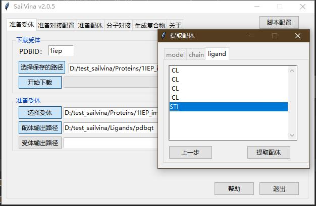
    关闭"提取配体"窗口。
    - 点击"受体输出路径",选择D:/test_sailvina/Proteins/1IEP_imatinib。点击准备受体。
    - 会自动检测同源链，点击否不删除同源链（测试发现删除同源链会出现一些问题）
    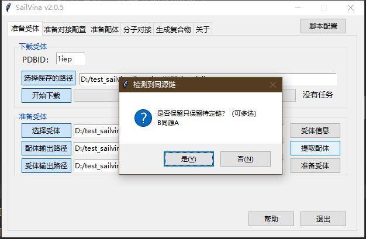
3. 生成对接config文件  
准备对接配置界面，工具
    - 点击"读取共晶配体"。选择D:/test_sailvina/Ligands/pdbqt/A_STI.pdbqt
    - 点击"计算对接位点",点击"确定"，参数会变成如下（由于盒子总大小不能超过27000，所以如果过大需要根据实际需求修改盒子大小）  
    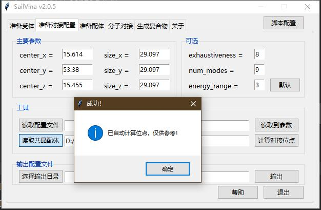
    - 点击"选择输出目录"，选择D:/test_sailvina/Proteins/1IEP_imatinib，点击"输出"
    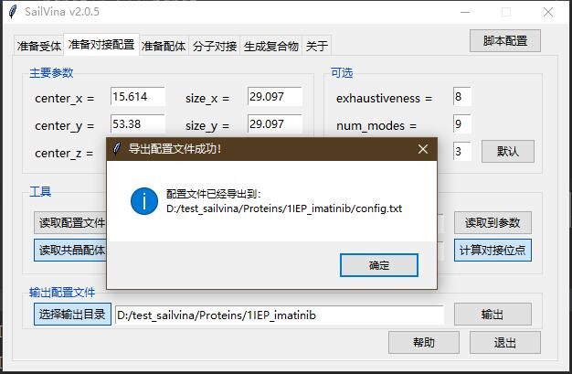
4. 准备配体  
使用化学作图软件（Chemdraw等）绘制出要对接的配体，保存成mol格式。（作为对接的验证，需要重新绘制原始共晶配体进行再对接re-docking，根据rmsd来判断对接的可靠程度。）本教程绘制2个，伊马替尼和尼洛替尼。保存到D:/test_sailvina/Ligands/mol文件夹中  
准备配体界面中，输入选项。
    - 输入格式选择mol
    - 点击"选择文件夹"，选择D:/test_sailvina/Ligands/mol
    - 输出选项中，输出格式选择pdbqt，其余保持默认。
    - 点击"选择输出文件夹", 选择D:/test_sailvina/Ligands/pdbqt。
    - 点击"开始转换"  
    
5. 分子对接  
分子对接界面中  
    - 选择配体中，点击"选择单/多个配体",选择imatinib.pdbqt和Nilotinib.pdbqt;
    - 选择受体中，点击"选择受体文件夹"，选择D:/test_sailvina/Proteins/1IEP_imatinib
    - 结果输出中，点击"选择输出文件夹"，选择D:/test_sailvina/Docking_output
    - 点击“开始对接”即可进行对接。（由于Vina对接会消耗大量CPU资源，如果出现未响应为正常现象，请等待对接完成）  
    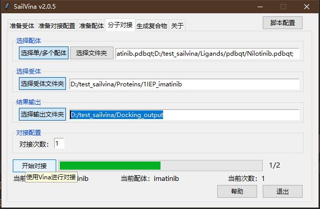
6. 生成共晶配合物  
生成复合物界面中
    - 输入格式选择pdbqt，其余保持默认。
    - 点击"选择单/多个配体"，选择D:/test_sailvina/Docking_output/1IEP_imatinib/imatinib_out1.pdbqt
    - 点击"选择受体", 选择D:/test_sailvina/Proteins/1IEP_imatinib/preped.pdbqt
    - 点击"选择输出文件夹",选择D:/test_sailvina/Docking_output
    - 点击"结合"即可生成配体受体复合物。
    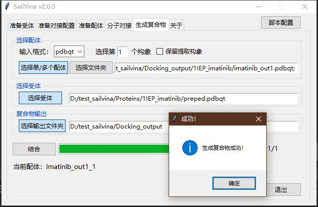
    - 将该pdb上传到[plip](https://projects.biotec.tu-dresden.de/plip-web/plip)即可查看分子间作用力（注意这里没有水分子，vina对接也没有水分子）
    
    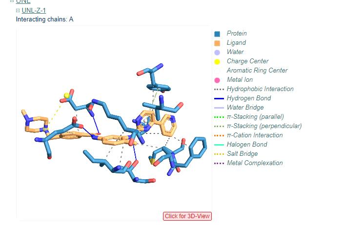
    